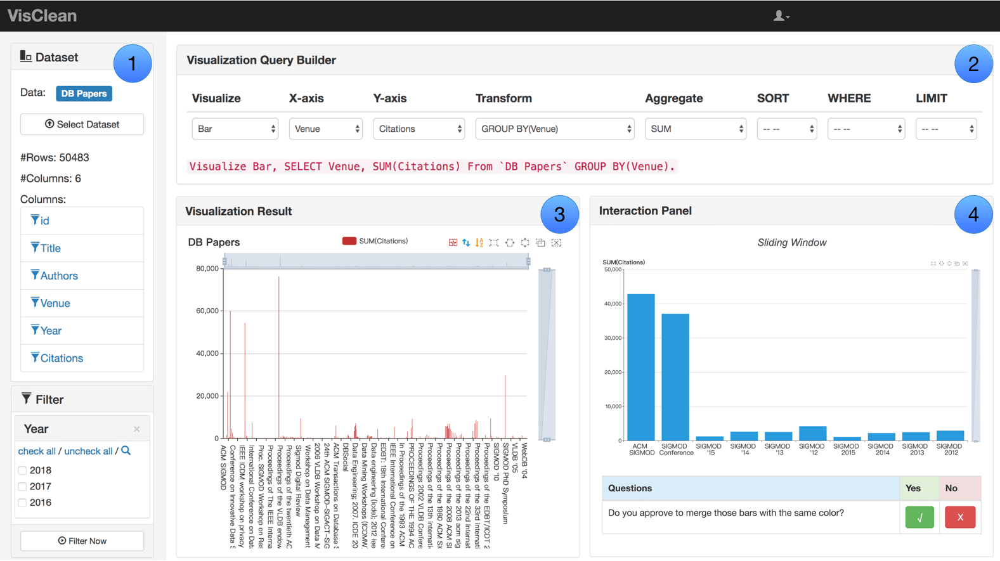
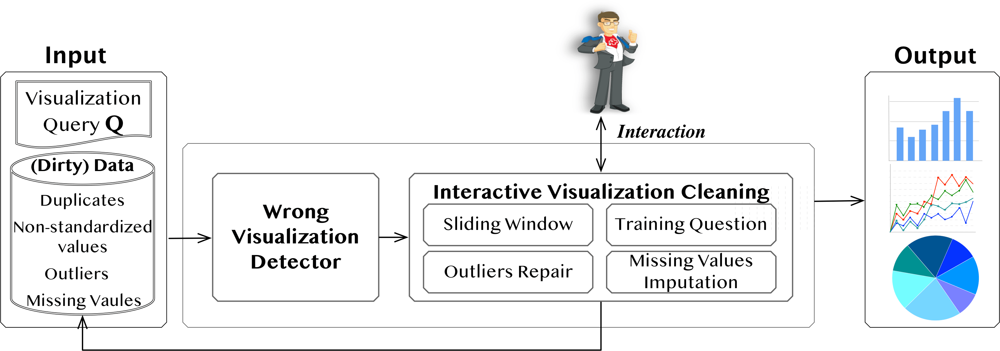

# VisClean V0.1  
VisClean is a web-based system that progressively turns wrong visualizations into correct ones by interactive data cleaning. 
It supports: (1) Wrong Visualization Detection: Given a dataset and a visualization, VisClean can automatically identify wrong visualizations caused by dirty data. 
(2) Active Interaction: VisClean provides a novel sliding-window-based method for users to directly manipulate the visualization (e.g., merging two bars) for cleaning the data. 
(3) Passive Interaction: VisClean also selects the most beneficial and visualization-aware cleaning questions to ask the user.


## Preview


## Architecture


## Getting Started
These instructions will get you a copy of the project up and running on your local machine for development and testing purposes. See deployment for notes on how to deploy the project on a live system.

### Prerequisites
- [x] Python 3.6
- [x] [Node.js v8.2.1](https://github.com/nodejs/node) for web service
- [x] [py_entitymatching](https://github.com/anhaidgroup/py_entitymatching/tree/rel_0.3.x) for EM


### Installing
Clone from Github
```
https://github.com/TsinghuaDatabaseGroup/VisClean.git
cd VisClean
```
A step by step series of examples that tell you how to get a development env running

Say what the step will be

```
Give the example
```

And repeat

```
until finished
```

End with an example of getting some data out of the system or using it for a little demo

## Running the tests

Explain how to run the automated tests for this system


## What's new feature will in VisClean V0.2?
- More friendly interaction and UI
- Release a development version for easily using in Ipython

## Contributors
|#|Contributor|Affiliation|Contact|
|---|----|-----|-----|
|1|[Yuyu Luo](http://thanksyy.cn)| M.S. Student, Tsinghua University| luoyy18@mails.tsinghua.edu.cn
|2|[Chengliang Chai](http://dbgroup.cs.tsinghua.edu.cn/chaicl/)| PhD Student, Tsinghua University| chaicl15@mails.tsinhua.edu.cn
|3|[Guoliang Li](http://dbgroup.cs.tsinghua.edu.cn/ligl/)|Professor, Tsinghua University| LastName+FirstName@tsinghua.edu.cn
|4|[Nan Tang](http://da.qcri.org/ntang/index.html)|Senior Scientist, Qatar Computing Research Institute|ntang@hbku.edu.qa
|5|Xuedi Qin| PhD Student, Tsinghua University| qxd17@mails.tsinghua.edu.cn
##### If you have any questions or feedbacks about this project, please feel free to contact Yuyu Luo (luoyy18@mails.tsinghua.edu.cn).
